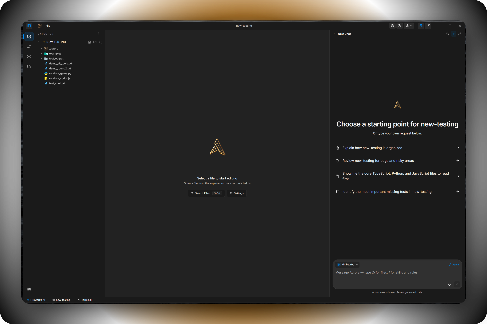
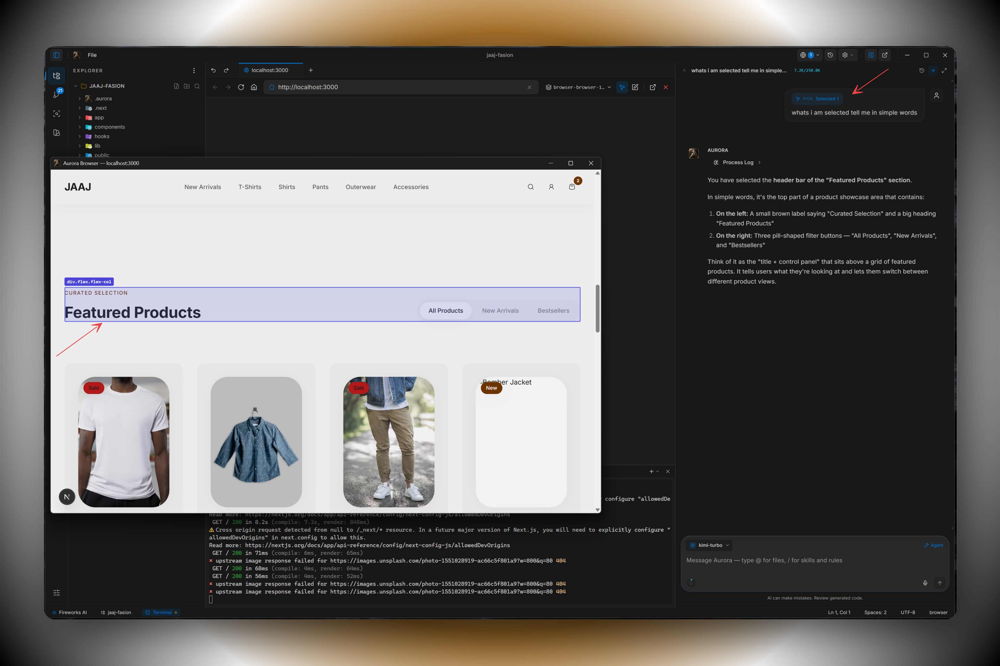

# Aurora — AI-powered code editor

<div align="center">

[](https://github.com/Aurora-LABS-Ai/aurora-ide)
[](LICENSE)
[](https://tauri.app)
[](https://reactjs.org)

**Desktop IDE (Tauri + React) with an agent that can use tools, MCP, Git, and semantic search.**

</div>

<br/>

<div align="center">


*Agent mode in action — the assistant drives a full edit-test-refine loop with the timeline pinned beside Monaco. Every tool call (file reads, search-and-replace, shell commands, MCP) streams in real time so you watch the agent work rather than guess at it.*

</div>

---

## Overview

**Aurora** is an agentic code editor: VS Code–style workspace (explorer, editor, terminal, Git) plus a chat/agent that can edit files, run shell commands, use MCP servers, and search the codebase semantically. State persists in SQLite; the Rust backend handles context, checkpoints, and providers.

<div align="center">



*Default workspace — the layout that opens on first launch. File explorer, Monaco editor with native tabs, integrated PTY terminal, and the agent panel docked to the right. Themed end-to-end through a single CSS-variable token system so every surface (Monaco, sidebar, terminal, chat, dialogs) stays in sync when you swap themes.*

</div>

### Highlights

- **Agent and tools** — 25+ native Rust tools (file ops, shell, grep, semantic search, browser, todo), MCP server bridge, per-tool approval modes (auto / always-ask / deny), live streaming preview into Monaco as the agent writes.
- **Themes** — token-based CSS variables, built-in dark/light packs, importable JSON themes, full Monaco token sync.
- **Project workflow** — Git panel (status, stage, commit, diff, branches), per-message workspace checkpoints with one-click restore, per-file undo/redo backed by Monaco's stack, detachable chat windows.
- **Models** — OpenAI-compatible and Anthropic-style providers (Fireworks, GLM, DeepSeek, MiniMax, LM Studio, Ollama, OpenAI, Anthropic, custom). Thinking modes wired up where the provider supports them.
- **Search** — optional ONNX semantic search (hybrid lexical + embeddings) alongside ripgrep-backed text search.
- **Browser tools** — native Tauri WebView windows the agent can drive (click, eval, DOM capture, console logs, element inspection).

### Built-in browser inspector

The agent can open and inspect real WebView windows. Picked elements, computed styles, console logs, and screenshots flow back into the chat as structured tool results — useful for UI work where the agent needs to see what's actually on screen.

<div align="center">



*Browser inspector — click any element in the agent's preview window and the picker emits the selector, bounding rect, computed styles, and attribute table straight into the next agent turn. The agent can also navigate, scroll, evaluate JavaScript, and capture the DOM without leaving the IDE.*

</div>

---

## Tech stack

| Layer | Stack |
|--------|--------|
| **UI** | React 18, TypeScript, Vite, Tailwind, Monaco, Zustand |
| **Desktop** | Tauri 2, Rust, SQLite (rusqlite), plugins (fs, shell, dialog, pty, …) |
| **AI** | Pluggable LLM providers, Rust context engine, optional semantic search |

---

## Quick Start

**New to Aurora?** See the full [Getting Started Guide](DOCS/GETTING-STARTED.md) for a walkthrough with screenshots.

### One-Command Setup

The setup script detects your OS/GPU and builds with the correct flags:

```bash
# macOS / Linux
./scripts/setup.sh

# Windows PowerShell
.\scripts\setup.ps1
```

### Manual Development

**Prerequisites:** Node 18+, **pnpm**, Rust stable, [Tauri prerequisites](https://v2.tauri.app/start/prerequisites/) for your OS.

```bash
pnpm install

# Full app (Tauri + Vite)
pnpm tauri:dev

# Web UI only — http://localhost:5173
pnpm dev

pnpm build          # frontend production build
pnpm tauri:build    # desktop installers
pnpm test
pnpm lint
```

### Platform Build Matrix

| Platform | Default | GPU Acceleration |
|----------|---------|------------------|
| **All** | `pnpm tauri:dev` (CPU-only) | — |
| **NVIDIA** | — | `--features cuda` |
| **Windows** | — | `--features directml` |
| **macOS** | — | `--features coreml` |

See **`CLAUDE.md`** / **`AGENTS.md`** and **`DOCS/`** for architecture, stores, and conventions.

---

## Architecture (short)

- **Frontend:** React panels (agent, chat, editor, explorer, terminal, Git, settings).  
- **State:** Many focused Zustand stores (`src/store/`) — settings, threads, editor, workspace, theme, MCP, checkpoints, etc.  
- **Backend:** Tauri commands for FS, Git, DB, context engine, MCP, checkpoints, tokens, semantic search.  
- **Data:** SQLite under the app data directory (threads, providers, workspace state, themes, …).

---

## Documentation

| Doc | Purpose |
|-----|---------|
| [DOCS/GETTING-STARTED.md](DOCS/GETTING-STARTED.md) | **Quick start & first launch** |
| [DOCS/01-ARCHITECTURE.md](DOCS/01-ARCHITECTURE.md) | Architecture |
| [DOCS/04-PROVIDER-KERNEL.md](DOCS/04-PROVIDER-KERNEL.md) | Provider contract blueprint |
| [DOCS/03-EXPANSION-GUIDE.md](DOCS/03-EXPANSION-GUIDE.md) | Contributing / extending |
| [DOCS/theme-dev.md](DOCS/theme-dev.md) | Theme tokens |

---

## Project status and feedback

Aurora is being built in the open by a very small team — most of the heavy lifting happens between other commitments, so the issue tracker is intentionally quiet. **Please do not open issues for bugs or feature requests right now.** Anything you would normally file there will be resolved as part of the regular work-in-progress cycle once we get back to it.

If something blocks you and you cannot wait, the source-available license lets you fork the repo and customise it for your own use. Patches that fit the existing patterns (token-based theming, Zustand store actions, Rust-side tool plumbing) are welcome later when the tracker reopens.

---

## License

This project is **source-available** under the [Aurora Source-Available License](LICENSE): you may use and contribute for **personal and non-commercial** purposes. **Commercial use, enterprise deployment, sale, or paid/hosted offerings require prior written permission** from the copyright holders. Contact the maintainers to request a commercial license.

---

## Acknowledgments

Aurora is developed by **[Aurora Labs](https://github.com/Aurora-LABS-Ai)** with substantial assistance from agentic coding tools — most of the codebase was written, refactored, and reviewed across loops in **[Cursor](https://www.cursor.com/)**, **[Claude Code](https://docs.claude.com/en/docs/claude-code)** (Anthropic), and **[Codex](https://openai.com/codex/)** (OpenAI). The desktop shell, editor, and broader runtime stand on **[Tauri](https://tauri.app)**, **[Monaco Editor](https://github.com/microsoft/monaco-editor)**, **[React](https://react.dev)**, and the wider open-source ecosystem.

---

<div align="center">

**Aurora**

[Documentation](DOCS/)

</div>
