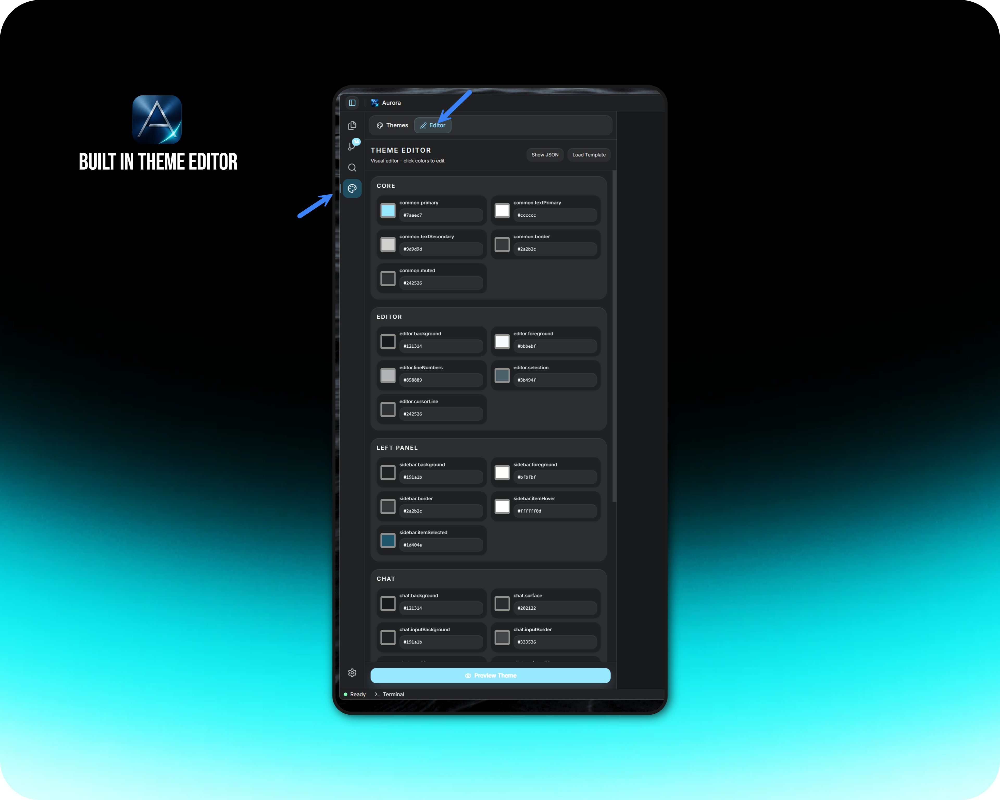

# Aurora — AI-powered code editor

<div align="center">

[](https://github.com/Aurora-LABS-Ai/aurora-ide)
[](LICENSE)
[](https://tauri.app)
[](https://reactjs.org)

**Desktop IDE (Tauri + React) with an agent that can use tools, MCP, Git, and semantic search.**

</div>

<br/>

<div align="center">


*Agent mode — assistant runs in the loop with tools, timeline, and file context.*

</div>

---

## Overview

**Aurora** is an agentic code editor: VS Code–style workspace (explorer, editor, terminal, Git) plus a chat/agent that can edit files, run shell commands, use MCP servers, and search the codebase semantically. State persists in SQLite; the Rust backend handles context, checkpoints, and providers.

<div align="center">


*Default layout — editor, sidebar, chat, and integrated terminal.*

</div>

### Highlights

- **Agent & tools** — 25+ built-in tools, MCP, approvals, agent mode UI  
- **Themes** — token-based CSS variables, built-in dark/light and custom JSON themes, Monaco sync  
- **Project** — Git panel, checkpoints, undo/redo for AI edits, detachable chat  
- **Models** — OpenAI-compatible and Anthropic-style providers, thinking modes where supported  
- **Search** — optional semantic (embeddings) plus lexical search  

### Theme system

Themes are data-driven (`src/themes/`, imported JSON). The settings UI includes a built-in theme workflow aligned with the editor.

<div align="center">



*Theme library and built-in editor — pick or import JSON themes with live tokens.*

</div>

---

## Tech stack

| Layer | Stack |
|--------|--------|
| **UI** | React 18, TypeScript, Vite, Tailwind, Monaco, Zustand |
| **Desktop** | Tauri 2, Rust, SQLite (rusqlite), plugins (fs, shell, dialog, pty, …) |
| **AI** | Pluggable LLM providers, Rust context engine, optional semantic search |

---

## Quick Start

**New to Aurora?** See the full [Getting Started Guide](DOCS/GETTING-STARTED.md) for a walkthrough with screenshots.

### One-Command Setup

The setup script detects your OS/GPU and builds with the correct flags:

```bash
# macOS / Linux
./scripts/setup.sh

# Windows PowerShell
.\scripts\setup.ps1
```

### Manual Development

**Prerequisites:** Node 18+, **pnpm**, Rust stable, [Tauri prerequisites](https://v2.tauri.app/start/prerequisites/) for your OS.

```bash
pnpm install

# Full app (Tauri + Vite)
pnpm tauri:dev

# Web UI only — http://localhost:5173
pnpm dev

pnpm build          # frontend production build
pnpm tauri:build    # desktop installers
pnpm test
pnpm lint
```

### Platform Build Matrix

| Platform | Default | GPU Acceleration |
|----------|---------|------------------|
| **All** | `pnpm tauri:dev` (CPU-only) | — |
| **NVIDIA** | — | `--features cuda` |
| **Windows** | — | `--features directml` |
| **macOS** | — | `--features coreml` |

See **`CLAUDE.md`** / **`AGENTS.md`** and **`DOCS/`** for architecture, stores, and conventions.

---

## Architecture (short)

- **Frontend:** React panels (agent, chat, editor, explorer, terminal, Git, settings).  
- **State:** Many focused Zustand stores (`src/store/`) — settings, threads, editor, workspace, theme, MCP, checkpoints, etc.  
- **Backend:** Tauri commands for FS, Git, DB, context engine, MCP, checkpoints, tokens, semantic search.  
- **Data:** SQLite under the app data directory (threads, providers, workspace state, themes, …).

---

## Documentation

| Doc | Purpose |
|-----|---------|
| [DOCS/GETTING-STARTED.md](DOCS/GETTING-STARTED.md) | **Quick start & first launch** |
| [DOCS/01-ARCHITECTURE.md](DOCS/01-ARCHITECTURE.md) | Architecture |
| [DOCS/03-EXPANSION-GUIDE.md](DOCS/03-EXPANSION-GUIDE.md) | Contributing / extending |
| [DOCS/theme-dev.md](DOCS/theme-dev.md) | Theme tokens |

---

## Contributing

Issues and PRs are welcome. Follow **`DOCS/03-EXPANSION-GUIDE.md`** and existing patterns (theme tokens, store actions, no hardcoded IDE colors in UI).

---

## License

This project is **source-available** under the [Aurora Source-Available License](LICENSE): you may use and contribute for **personal and non-commercial** purposes. **Commercial use, enterprise deployment, sale, or paid/hosted offerings require prior written permission** from the copyright holders. Contact the maintainers (e.g. via [Issues](https://github.com/Aurora-LABS-Ai/aurora-ide/issues)) to request a commercial license.

---

## Acknowledgments

Built with [Tauri](https://tauri.app), [Monaco Editor](https://github.com/microsoft/monaco-editor), [React](https://react.dev), and the broader open-source ecosystem.

---

<div align="center">

**Aurora**

[Documentation](DOCS/) · [Issues](https://github.com/Aurora-LABS-Ai/aurora-ide/issues)

</div>
