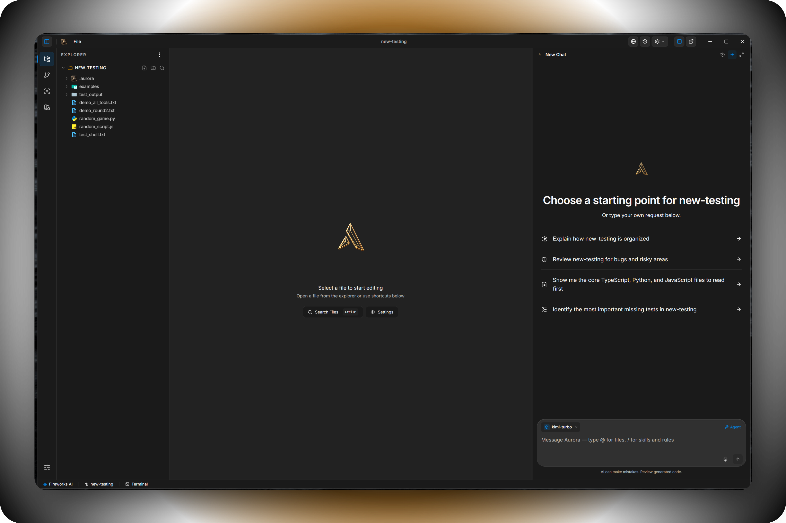
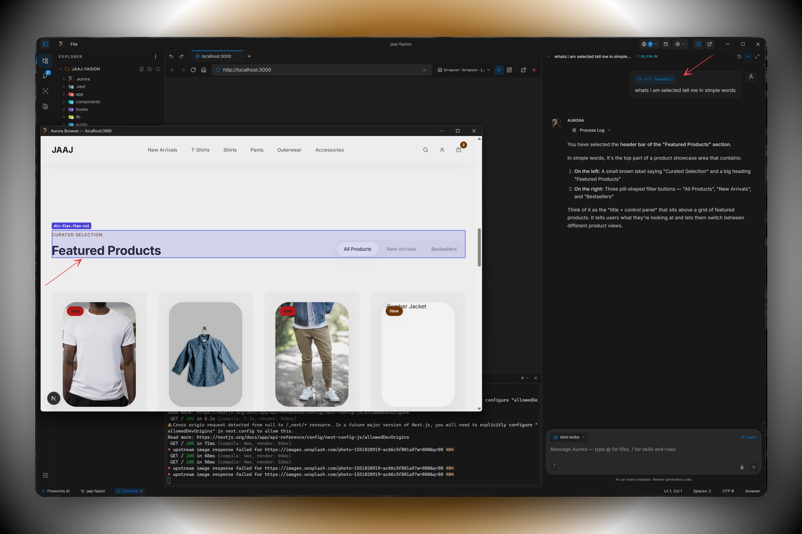

# Aurora

A desktop coding IDE with an agent that can read, edit, run, and browse — in a
separate conversation window, with a real editor beside it.

<div align="center"> 

[](https://github.com/Aurora-LABS-Ai/aurora-ide/releases/latest)
[](LICENSE)
[](https://tauri.app)
[](https://github.com/Aurora-LABS-Ai/aurora-ide/releases/latest)

</div> 
 
<div align="center">


*Agent Window — the turn loop, tool cards, and workspace in one place.*

</div>

## What it is

One Tauri app, two windows:

| Window | What you do there |
|--------|-------------------|
| **IDE** | Explorer, Monaco, terminal, Git, themes |
| **Agent Window** | Chat, review diffs, Canvas, files, browser, plan |

The Agent Window is the conversation surface. The IDE is the editor. They share
one workspace. Rust owns the agent turn loop, providers, native tools, sessions,
checkpoints, MCP, the tree-sitter code index, and browser WebViews. React owns
the two UIs.

**Modes:** Agent (full tools) · Plan (inspect and write a plan, no workspace
edits) · Team (a Lead can dispatch parallel workers).

**Providers:** Fireworks AI, GLM (Z.AI), Anthropic, Meta Model API, MiniMax,
DeepSeek, OpenAI, OpenAI (Responses), Kenari, Volcano Ark, Modal, LM Studio and
Ollama, plus Claude Code, Codex (ChatGPT login), Cursor and CommandCode
accounts, or a custom OpenAI-compatible row.

Also in the box: MCP (stdio, SSE, streamable HTTP), git checkpoints per user
message, a local code index that never leaves the machine, and a native browser
the agent can drive. Dictation runs out of process against a runtime you point
it at: CrispASR when you stop, audio.cpp with a Confucius4-R2T2 model as you
speak.

<div align="center">



*IDE — explorer, Monaco, terminal, token-themed chrome.*

</div>

<div align="center">



*Built-in browser — the agent opens a real WebView, not an iframe.*

</div>

## Install

Windows 10/11 x64. Download the `.msi` (recommended) or the NSIS `.exe` from
[Releases](https://github.com/Aurora-LABS-Ai/aurora-ide/releases/latest) and run
it. The installer carries the WebView2 bootstrapper, needs nothing installed
first, and puts the `aurora` and `agw` commands on your PATH.

## Run it

**Prerequisites:** Node 22 (Vite 8 needs 20.19+ or 22.12+),
[pnpm](https://pnpm.io) 9+, Rust **1.92.0** (pinned in `rust-toolchain.toml`),
and the [Tauri 2 OS prerequisites](https://v2.tauri.app/start/prerequisites/).

```bash
pnpm install
pnpm tauri:dev          # full app (first Rust build is slow)
```

```bash
# macOS / Linux
./scripts/setup.sh

# Windows PowerShell
.\scripts\setup.ps1
```

| Command | What it does |
|---------|----------------|
| `pnpm dev` | Frontend only, on http://localhost:5273 |
| `pnpm test` | Vitest |
| `pnpm tauri:build` | Desktop installers (`.msi` and NSIS `.exe`) |
| `pnpm crispasr:package` | Zip a CrispASR runtime folder for sharing |

Dictation needs its own runtime and model picked in Settings, speech: a folder
holding `crispasr.exe` for transcribe-on-stop, and `audiocpp_cli.exe` plus a
Confucius4-R2T2 GGUF for live words.

**First launch:** Settings → Providers (API key or local LM Studio / Ollama),
open a workspace folder, then chat from the Agent Window.

Full walkthrough: [DOCS/GETTING-STARTED.md](DOCS/GETTING-STARTED.md).
IDE theme tokens: [DOCS/theme-dev.md](DOCS/theme-dev.md).

## Stack

React 18 + TypeScript + Vite 8 (IDE uses Tailwind; the Agent Window is
token CSS). Tauri 2 + Rust 2021. Sessions are JSONL; settings and providers
live in SQLite under `%LOCALAPPDATA%\AuroraIDE\` (macOS/Linux: the equivalent
app-data root).

## Status

Source-available, small team. **Please do not open issues for bugs or feature
requests right now** — the tracker is intentionally quiet.

## License

[Aurora Source-Available License](LICENSE): personal and non-commercial use.
Commercial, enterprise, or hosted use needs written permission.

---

<div align="center">

[Getting started](DOCS/GETTING-STARTED.md) · [Aurora Labs](https://github.com/Aurora-LABS-Ai)

</div>
